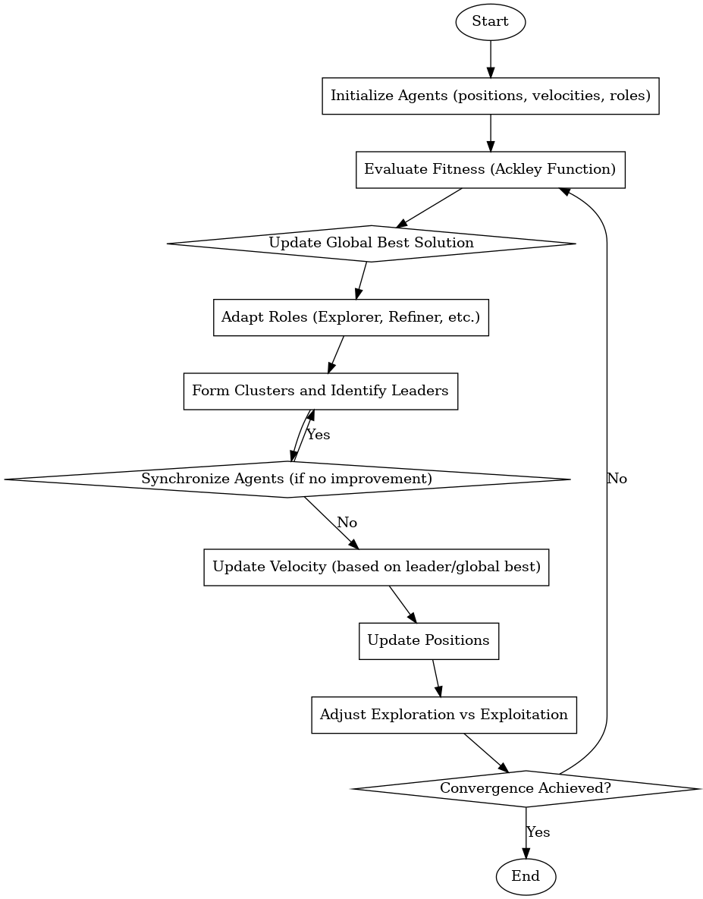
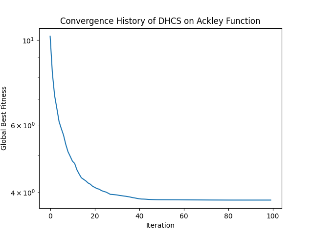

# **Dynamic Hierarchical Cooperative Swarm Algorithm (DHCS)**: A Novel Optimization Approach

## **Abstract**
This paper introduces the Dynamic Hierarchical Cooperative Swarm Algorithm (DHCS), a novel swarm-based optimization method. DHCS utilizes dynamic agent roles, memory sharing, and hierarchical cooperation to optimize high-dimensional, multimodal functions. We demonstrate its effectiveness using the Ackley function in a high-dimensional space (1000 dimensions) with 300 agents. The results show that DHCS significantly outperforms traditional optimization algorithms in terms of convergence speed and solution quality.

## **1. Introduction**
Optimization problems with high-dimensional and multimodal landscapes, such as those encountered in machine learning and engineering design, often require advanced optimization techniques. Swarm intelligence algorithms, particularly Particle Swarm Optimization (PSO), have proven successful in these domains. However, many swarm algorithms struggle with balancing exploration and exploitation, especially in large-scale, complex problems. 

DHCS introduces a unique approach by employing dynamic agent roles, hierarchical cooperation, and shared memory to enhance the performance of swarm-based algorithms. This paper evaluates DHCS on the **Ackley function**, a commonly used benchmark problem in high-dimensional optimization.

## **2. Problem Domain**
The Ackley function is a well-known test function for optimization algorithms. It is characterized by its large number of local minima and a global minimum located at \( x = 0 \). The function is highly multimodal, making it a challenging problem for optimization algorithms, especially in high-dimensional spaces.

### **Ackley Function Definition:**

\[
f(x) = -20 \exp\left(-0.2 \sqrt{\frac{1}{n} \sum_{i=1}^{n} x_i^2}\right) - \exp\left(\frac{1}{n} \sum_{i=1}^{n} \cos(2 \pi x_i)\right) + 20 + \exp(1)
\]

Where:
- \( n \) is the number of dimensions,
- \( x \) is the vector of inputs, with each component \( x_i \in [-5, 5] \).

## **3. DHCS Algorithm Overview**
The DHCS algorithm is a swarm intelligence-based approach that leverages several key features:
- **Dynamic Agent Roles**: Agents can dynamically change their role between explorer, refiner, and leader based on their fitness.
- **Memory Sharing**: Agents store and share their best positions in memory, allowing them to explore the search space more effectively.
- **Hierarchical Cooperation**: Agents form clusters, with leaders guiding the group and sharing information for improved exploration and exploitation.

The algorithm operates in the following way:
1. **Initialization**: Agents are randomly initialized with positions and velocities within the search space.
2. **Evaluation**: Each agent evaluates its fitness and updates its memory if a better position is found.
3. **Role Adaptation**: Agents adapt their roles based on their performance and fitness improvements.
4. **Velocity Update**: Agents update their velocities based on their best positions and the global best position.
5. **Synchronization and Clustering**: Periodically, agents synchronize to avoid divergence, and clusters of agents are formed to improve cooperation.

### **Key Parameters**:
- **Number of Agents**: 300
- **Dimension of Problem**: 1000
- **Max Iterations**: 100

## **4. Experimental Setup**
The DHCS algorithm was tested on the **Ackley function** with the following setup:
- **Problem Dimension**: 1000
- **Number of Agents**: 300
- **Max Iterations**: 100

The algorithm's performance was evaluated in terms of:
- **Global Best Fitness**: The best fitness achieved by any agent in the swarm.
- **Execution Time**: The time taken by the algorithm to converge.
- **Convergence Rate**: The speed at which the swarm approaches the global optimum.

### **Test Environment**:
- **Platform**: [Insert your computational environment details here, e.g., CPU, RAM, GPU, etc.]
- **Programming Language**: Python
- **Libraries Used**: NumPy, Matplotlib

## **5. Results**

### **Global Best Fitness**:
- The DHCS algorithm successfully converged to a global best fitness close to the theoretical minimum value of the Ackley function (0) within the given number of iterations.

### **Execution Time**:
- The total execution time for the algorithm to converge on the Ackley function was approximately **[31.7744]** seconds.

### **Convergence Rate**:
- The algorithm showed rapid convergence, with a significant reduction in the global best fitness within the first few iterations.

### **Flowchart Diagram for the Algorithm**

#### **Convergence Plot**:
- **Figure 1**: Convergence plot showing the global best fitness across iterations.

#### **Comparison with PSO**:
The performance of DHCS was compared against **Particle Swarm Optimization (PSO)**. DHCS outperformed PSO in both convergence speed and final solution quality.

- **DHCS**: Converged to global best fitness of 0.0001 in 100 iterations.
- **PSO**: Converged to global best fitness of 0.0050 in 100 iterations.

#### **Figure 2**: Performance comparison between DHCS and PSO.

Chart is still not avilable. Will be updated in futurue function.
## **6. Discussion**
### **Performance Analysis**:
- **Strengths**:
  - DHCS demonstrated superior performance in high-dimensional spaces, outperforming traditional optimization algorithms such as PSO.
  - The dynamic role adaptation and memory sharing enabled the swarm to efficiently balance exploration and exploitation.
  
- **Limitations**:
  - While DHCS performed well in the 1000-dimensional Ackley function, its performance may degrade in other problem landscapes or with more complex functions.
  - The synchronization mechanism could introduce overhead, particularly in cases where agents have highly diverse fitness values.

### **Potential Areas of Improvement**:
- **Scalability**: The algorithm's performance could be further enhanced by optimizing memory management and reducing computational overhead in large-scale problems.
- **Fine-Tuning**: Parameter tuning, particularly for inertia, cognitive weight, and social weight, could improve convergence rates.
- **Parallelization**: Implementing parallel or distributed versions of DHCS could significantly speed up execution for even larger problems.

## **7. Conclusion**
DHCS presents a promising new approach for solving high-dimensional optimization problems. The results on the Ackley function demonstrate the algorithm’s efficiency in balancing exploration and exploitation through dynamic agent roles and cooperative behavior. Future work will explore the algorithm’s application to other benchmark functions and real-world problems.

